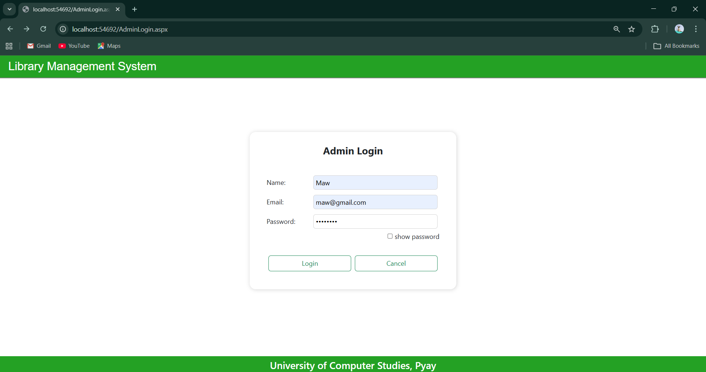
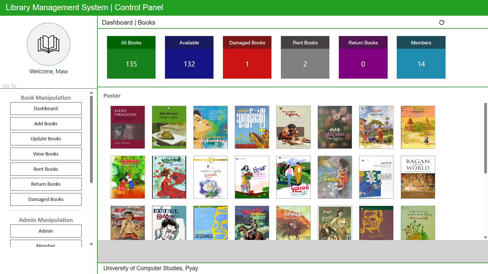
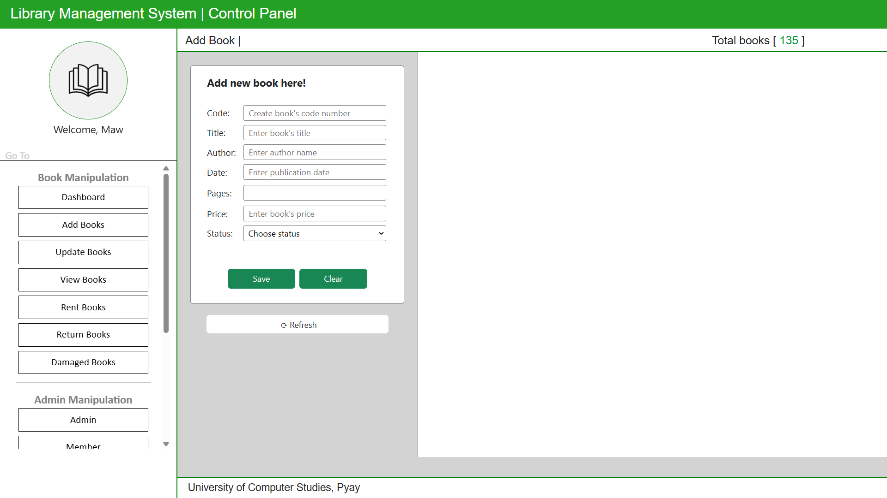
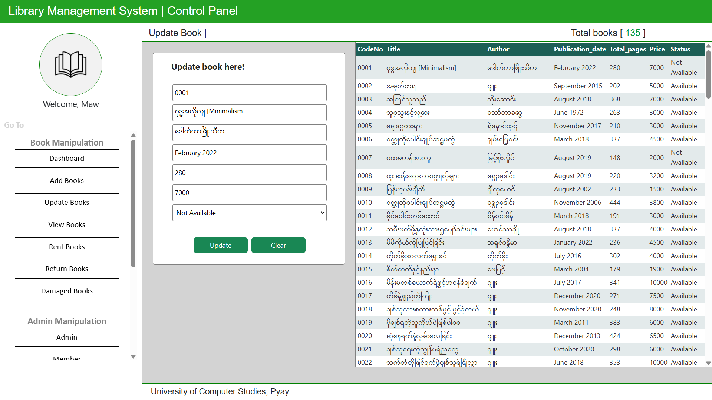
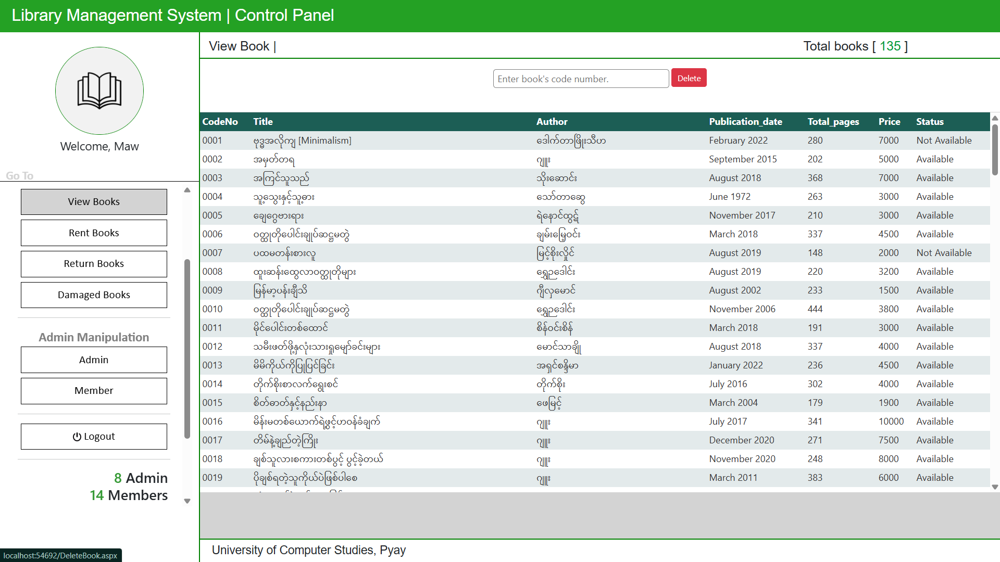
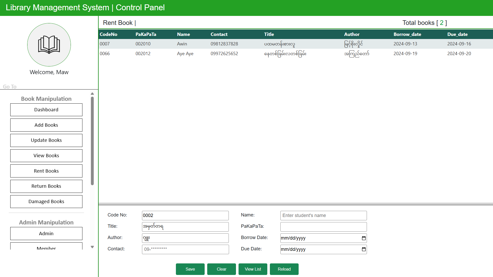
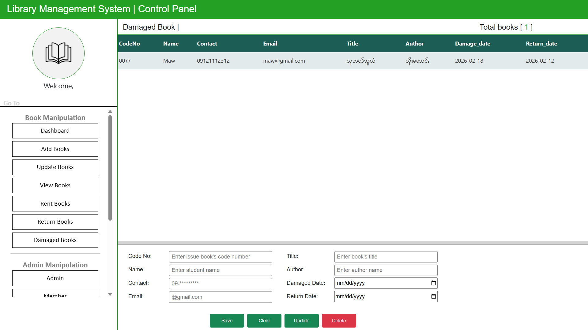
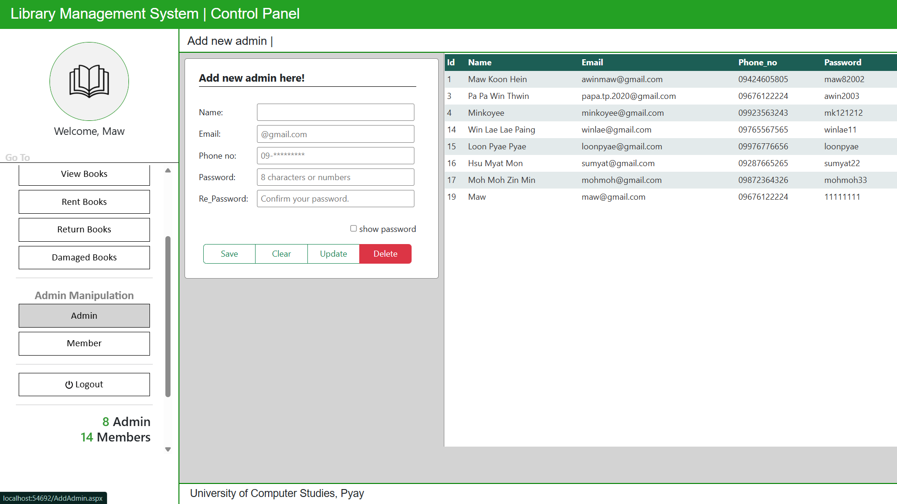
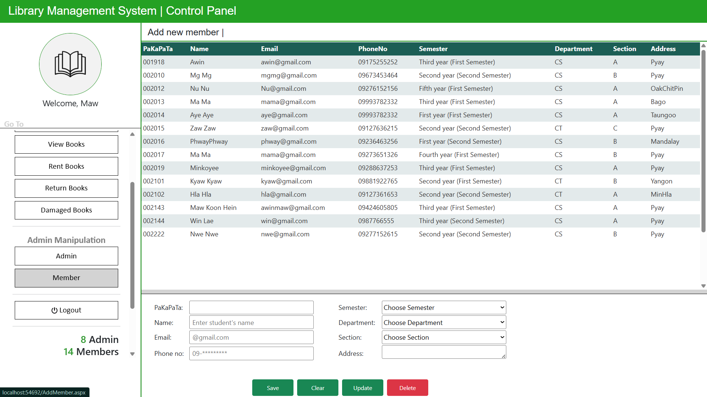

# Library_management_system
Library Management System (ASP.NET, C#)

 **Description:** A full-featured library management system.

 **Technologies:** C#, ASP.NET, HTML, CSS, Bootstrap
 
 **Features:**
  - Book catalog and search
  - Borrow/return system
  - User authentication

 **How to Run:**
  1. Open `Mini_LibraryManagementSystem.sln` in **Visual Studio**.
  2. Build the solution.
  3. Run using **IIS Express** or your preferred server.

## Screenshots

### Login Page

### Dashboard Page

### AddNewBook Page

### UpdateBook Page

### ViewBook Page

### RentBook Page

### DamagedBook Page

### AddNewAdmin Page

### AddNewMember Page

